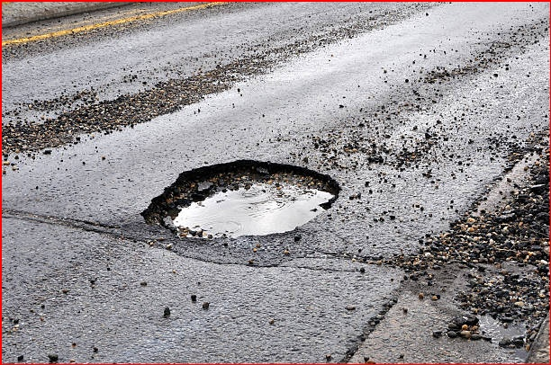

# 🕳️ Pothole Detection and Size Estimation

This project automatically detects potholes in road surface images using image processing techniques and optionally estimates their size in both pixels and square centimeters.

---

## 📸 Sample Output

| Input Image | Output with Bounding Boxes |
|-------------|----------------------------|
|  |  |

---

## 🧭 Project Roadmap

1. Accept raw road surface images as input.
2. (Optional) Calibrate the pixel-to-centimeter ratio using a reference object.
3. Detect potholes using OpenCV (edge detection, contour analysis, morphology).
4. Estimate pothole sizes:
   - In pixels (always)
   - In cm² (if calibrated)
5. Output:
   - Annotated images
   - CSV files with detailed size and location data

---

## ✅ Features

- 📷 **Automatic Pothole Detection**
- 📐 **Optional Calibration for Real-World Size Estimation**
- 📊 **CSV Report Generation**
- 📁 **Batch Processing of Multiple Images**
- 💬 **Simple Terminal Interface**

---

## 🗂️ Folder Structure

pothole-detection/
├── input_images/ # Input road surface images
├── outputs/ # Annotated images + CSV data
├── pothole_detector_with_calibration.py # Main script
└── README.md # Project documentation

---

## 🛠️ Requirements

- Python 3.x
- OpenCV

Install dependencies:
```bash
pip install opencv-python
```

---
## 🧪 Usage
- Place images in the input_images/ folder.
- Run the script:
```bash
copy
python pothole_detector_with_calibration.py
```
- When prompted: Click two points in the image with a known real-world distance.
- Enter the real-world distance in centimeters.
- The script will:
  Calculate pixel-to-cm ratio
- Process all images
- Save output to the outputs/ folder

## 📤 Outputs
For each input image:

✅ outputs/image_name.jpg
→ Annotated image with potholes and size labels

✅ outputs/image_name_data.csv
→ CSV table with:
```bash
pothole_id, area_pixels, area_cm2, bounding_box
```

## 🔍 Methodology
- Convert image to grayscale
- Apply Gaussian Blur
- Use Canny Edge Detection to find edges
- Apply morphological dilation to close gaps
- Find contours and filter by area
- Label and size each pothole
- If calibrated, compute:
```bash
Copy
Edit
area_cm² = area_pixels / (pixel_to_cm_ratio^2)
```
📘 Example
yaml
Copy
Edit
Detected 12 potholes in road2.jpg
road2_data.csv:
- Pothole 1: 1500 px, 19.80 cm²
- Pothole 2: 2200 px, 29.04 cm²
...
🧾 License
This project is released under the MIT License.

🙋‍♂️ Author
melo
GitHub: @hi-riddhi
